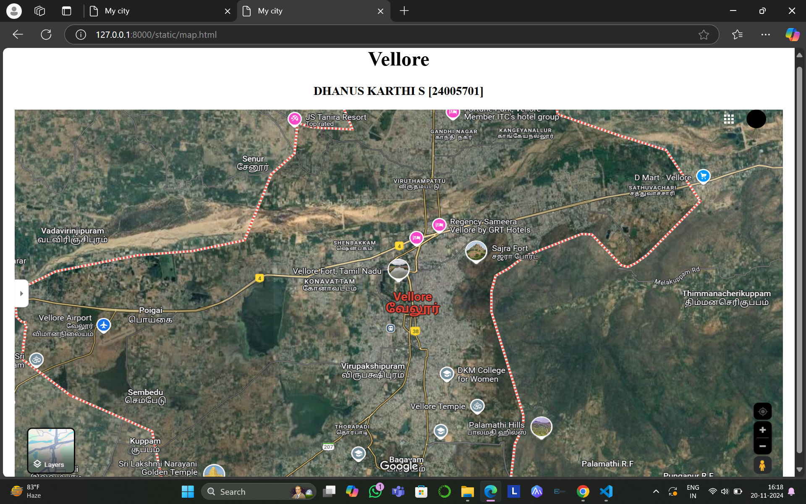
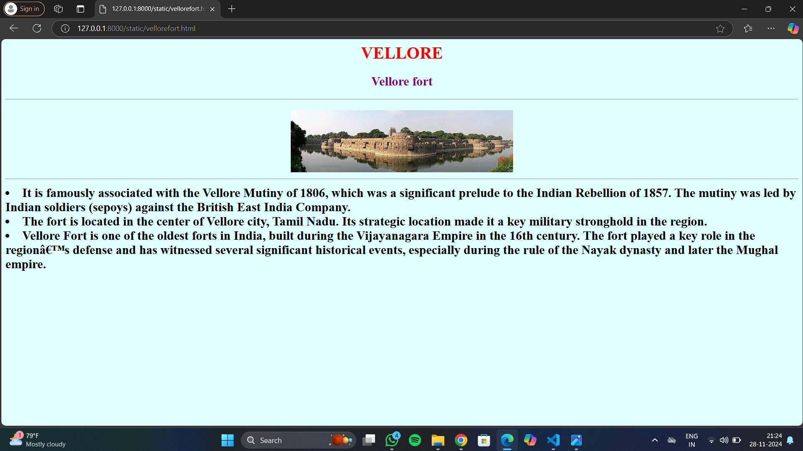
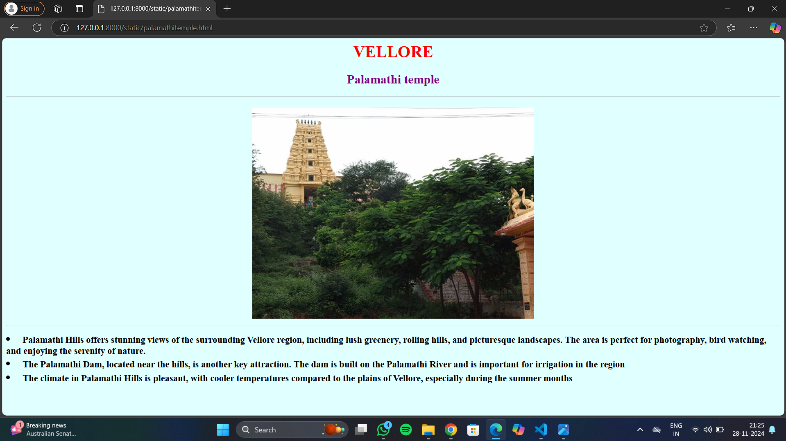
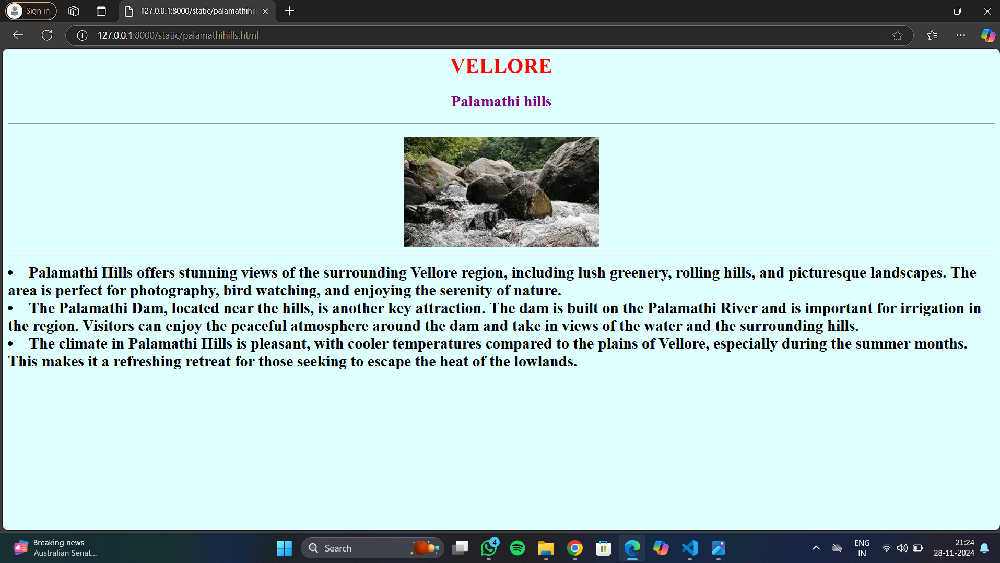
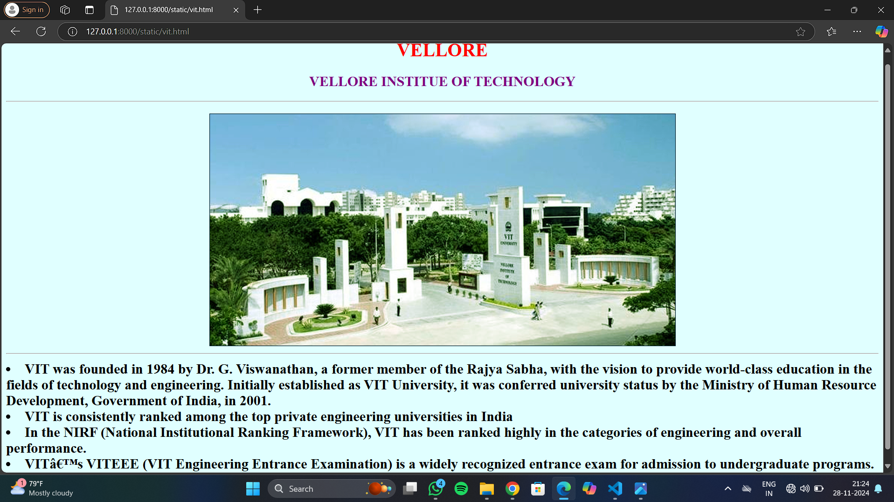

# Ex04 Places Around Me
## Date: 10-12-2024

## AIM
To develop a website to display details about the places around my house.

## DESIGN STEPS

### STEP 1
Create a Django admin interface.

### STEP 2
Download your city map from Google.

### STEP 3
Using ```<map>``` tag name the map.

### STEP 4
Create clickable regions in the image using ```<area>``` tag.

### STEP 5
Write HTML programs for all the regions identified.

### STEP 6
Execute the programs and publish them.

## CODE
```
map.html

<html>
    <head>
        <title>My City</title>   
    </head>
    <body>
        <h1 align="center">
            <font color="blue"><b>VELLORE</b></font>
        </h1>
        <h2 align="center">
            <font color="red"><b>DHANUS KARTHI S [24005701]</b></font> </h2>
        <h3 align="center">
            
            <map name="image-map">
                <area target="" alt="Vellore Institute of Technology" title="Vellore Institute of Technology" href="vit.html" coords="745,41,877,91" shape="rect">
                <area target="" alt="Palamathi Temple" title="Palamathi Temple" href="palamathitemple.html" coords="812,547,978,607" shape="rect">
                <area target="" alt="Palamathi Hills" title="Palamathi Hills" href="palamathihills.html" coords="785,615,932,641" shape="rect">
                <area target="" alt="Vellore fort" title="Vellore fort" href="vellorefort.html" coords="580,362,769,396" shape="rect">
                <area target="" alt="goldentemple" title="golgentemple" href="golden temple.png" coords="1156,500,1330,561" shape="rect">
            </map>
      </h3>
    </body>
</html>

goldentemple.html

<html lang="en"> 
<head>
    <meta charset="UTF-8">
    <meta name="viewport" content="width=device-width, initial-scale=1.0">
    <title>Sri lakshmi narayani Golden temple</title>

</head>
<body bgcolor="pink">
    <h1 align="center" style="font-family: cursive; color: rgb(189, 3, 152);">Sri lakshmi narayani Golden temple</h1>
    <h2 style="font-family: serif;"> Sripuram is the abode of the Goddess Lakshmi, the Goddess of Prosperity. The temple was built with pure
         gold (1500 kg) and has intricate work done by artisans specialising in temple art using gold.
</h2>    
</body>
</html>

vellorefort.html

<body bgcolor="#E0FFFF">
    <h1 align="center">
        <font color="red">
            VELLORE
        </font>
    </h1>
    <h2 align="center">
        <font color="purple">
            Vellore fort
        </font>
    </h2>
    <hr>
    <h2>
        <center>
            
        <hr>
        <li align="left">
            <font size="5">
                  It is famously associated with the Vellore Mutiny of 1806, which was a significant prelude to the Indian Rebellion of 1857. The mutiny was led by Indian soldiers (sepoys) against the British East India Company.        
                
         </font>
        </li>
        <li align="left">
            <font size="5">
                The fort is located in the center of Vellore city, Tamil Nadu. Its strategic location made it a key military stronghold in the region.
            </font>
        </li>
        <li align="left">
            <font size="5">
                Vellore Fort is one of the oldest forts in India, built during the Vijayanagara Empire in the 16th century. The fort played a key role in the region’s defense and has witnessed several significant historical events, especially during the rule of the Nayak dynasty and later the Mughal empire.  
            </font>
        </li>
        
    </h2>
</body>

</html>

palamathitemple.html

<html>

<body bgcolor="#E0FFFF">
    <h1 align="center">
        <font color="red">
            VELLORE
        </font>
    </h1>
    <h2 align="center">
        <font color="purple">
            Palamathi temple
        </font>
    </h2>
    <hr>
    <h2>
        <center>
            
        <hr>
        <li align="left">
            <font size="4">
                Palamathi Hills offers stunning views of the surrounding Vellore region, including lush greenery, rolling hills, and picturesque landscapes. The area is perfect for photography, bird watching, and enjoying the serenity of nature.
            </font>
        </li>
        <li align="left">
            <font size="4">
                The Palamathi Dam, located near the hills, is another key attraction. The dam is built on the Palamathi River and is important for irrigation in the region
            </font>
        </li>
        <li align="left">
            <font size="4">
                The climate in Palamathi Hills is pleasant, with cooler temperatures compared to the plains of Vellore, especially during the summer months
            </font>
        
    </h2>
</body>

</html> 

palamathihills.html

<html>

<body bgcolor="#E0FFFF">
    <h1 align="center">
        <font color="red">
            VELLORE
        </font>
    </h1>
    <h2 align="center">
        <font color="purple">
           Palamathi hills
        </font>
    </h2>
    <hr>
    <h2>
        <center>
            
        <hr>
        <li align="left">
            <font size="5">
                Palamathi Hills offers stunning views of the surrounding Vellore region, including lush greenery, rolling hills, and picturesque landscapes. The area is perfect for photography, bird watching, and enjoying the serenity of nature.   
            </font>
        </li>
        <li align="left">
            <font size="5">
                The Palamathi Dam, located near the hills, is another key attraction. The dam is built on the Palamathi River and is important for irrigation in the region. Visitors can enjoy the peaceful atmosphere around the dam and take in views of the water and the surrounding hills.  
            </font>
        </li>
        <li align="left">
            <font size="5">
                The climate in Palamathi Hills is pleasant, with cooler temperatures compared to the plains of Vellore, especially during the summer months. This makes it a refreshing retreat for those seeking to escape the heat of the lowlands.  
            </font>
        </li>
    </h2>
</body>

</html>


vit.html

<html>

<body bgcolor="#E0FFFF">
    <h1 align="center">
        <font color="red">
            VELLORE
        </font>
    </h1>
    <h2 align="center">
        <font color="purple">
         VELLORE INSTITUE OF TECHNOLOGY
        </font>
    </h2>
    <hr>
    <h2>
        <center>
            
        <hr>
        <li align="left">
            <font size="5">
                  VIT was founded in 1984 by Dr. G. Viswanathan, a former member of the Rajya Sabha, with the vision to provide world-class education in the fields of technology and engineering.
                  Initially established as VIT University, it was conferred university status by the Ministry of Human Resource Development, Government of India, in 2001.
                    
            </font>
        </li>
        <li align="left">
            <font size="5">
                  VIT is consistently ranked among the top private engineering universities in India  
            </font>
        </li>
        <li align="left">
            <font size="5">
                  In the NIRF (National Institutional Ranking Framework), VIT has been ranked highly in the categories of engineering and overall performance.  
            </font>
        </li>
        <li align="left">
            <font size="5">
                 VIT’s VITEEE (VIT Engineering Entrance Examination) is a widely recognized entrance exam for admission to undergraduate programs. 
            </font>
        </li>
    </h2>
</body>

</html>
```


## OUTPUT











## RESULT
The program for implementing image maps using HTML is executed successfully.
